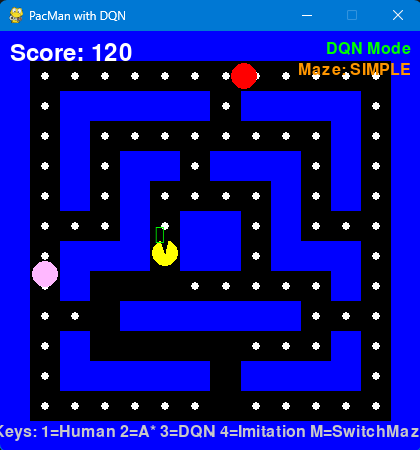

# PACMAN-RL-VS-BC

A Pacman game implementation that compares Reinforcement Learning (DQN) with Behavioural Cloning (Imitation Learning) approaches for game AI.



## Project Overview

This project implements a Pacman game environment where the player (Pacman) can be controlled by either:
1. A Deep Q-Network (DQN) trained through reinforcement learning
2. A Behavioural Cloning model trained through imitation learning

The goal is to compare the performance and learning characteristics of these two different approaches to game AI.

## Features

- Classic Pacman gameplay with ghosts and pellets
- Two different maze configurations (Simple and Complex)
- DQN-based reinforcement learning implementation
- Behavioural Cloning through imitation learning
- Expert demonstration recording and playback
- Automated testing framework
- Enhanced feature extraction for better learning
- Visual rendering of the game state

## Controls

### Game Modes
- `1`: Switch to HUMAN mode (manual control)
- `2`: Switch to A_STAR mode (automatic pathfinding)
- `3`: Switch to DQN mode (reinforcement learning)
- `4`: Switch to IMITATION mode (behavioural cloning)

### Human Mode Controls
- `↑`: Move up
- `↓`: Move down
- `←`: Move left
- `→`: Move right

### Game Management
- `M`: Switch between Simple and Complex maze
- `SPACE`: Restart game (when game over or won)

### Demonstration Recording (when RECORD_DEMONSTRATIONS = True)
- `R`: Start recording demonstration (in HUMAN mode)
- `T`: Stop recording demonstration
- `C`: Cancel current recording
- `A`: Analyse all recorded demonstrations

## Project Structure

```
PACMAN-RL-VS-BC/
├── dqn/              # Deep Q-Network implementation
├── imitation/        # Behavioural Cloning implementation
├── entities/         # Game entities (Pacman, Ghosts)
├── rendering/        # Game rendering utilities
├── utils/            # Helper functions and utilities
├── experiments/      # Experiment configurations and results
├── outputs/          # Model outputs and saved data
├── images/           # Screenshots and other images
├── main.py           # Main game loop and entry point
└── constants.py      # Game constants and configurations
```

## Requirements

- Python 3.x
- Pygame
- PyTorch
- NumPy

## Usage

### Running the Game

1. Clone the repository
2. Install dependencies
3. Run `main.py` with appropriate configuration flags

### Training Modes

- **DQN Training**: Set `TRAINING_MODE = True` in main.py
- **Imitation Learning**: Set `IMITATION_MODE = True` and `TRAIN_IMITATION_MODEL = True`
- **Expert Demonstration**: Set `RECORD_DEMONSTRATIONS = True`

### Testing

Set `TESTING_MODE = True` to run automated testing of the trained models.

## TensorBoard Usage

To monitor training progress and visualise metrics:

1. Launch TensorBoard from command line:
   ```bash
   tensorboard --logdir=./outputs/logs/tensorboard
   ```

2. Open your web browser and go to:
   ```
   http://localhost:6006
   ```

## Configuration

Key configuration parameters in `main.py`:
- `TRAINING_TIMESTEPS`: Number of training steps for DQN
- `IMITATION_EPOCHS`: Number of epochs for imitation learning
- `MAZE_TYPE`: "SIMPLE" or "COMPLEX" maze configuration
- `USE_ENHANCED_FEATURES`: Enable/disable enhanced feature extraction

## Results

The project outputs trained models and performance metrics in the `outputs/` directory.
